# KDIT Ticketing System

## What project is it?

> This web application is Ticketing System for IT solution company. I created this project in the fourth semester of college <a href="https://www.sait.ca/programs-and-courses/diplomas/information-technology" target='_blank'>(SAIT)</a>.

## Homepage

<a href="http://kdit.thejaehokim.com" target='_blank'>KDIT-Ticketing-System</a>

## Languages

## Functionality

- ### Authentication:

  #### Login
    To log in to the application use the email/password input boxes and Click “Login” when finished.
    
    
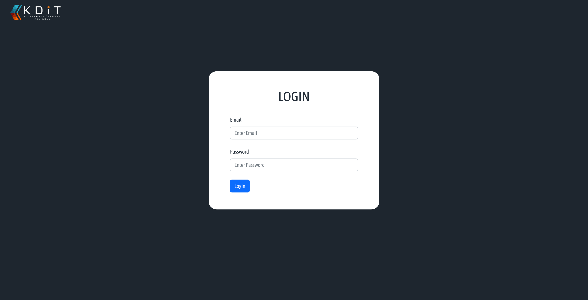

    
  #### Logout
    To log out of the application click the “Logout” button located in the navigation bar on the left-hand side of the application. 
    
    
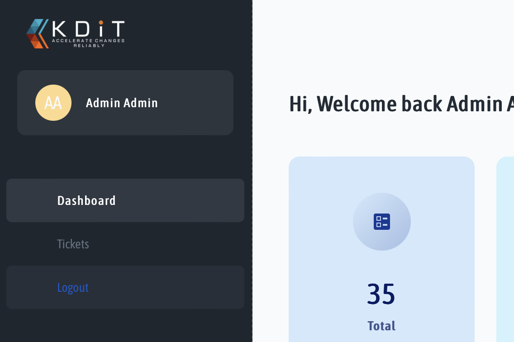

* ### Dashboard:

  #### Regular Users
  
  *	Regular Users can view the status of tickets assigned to them
    * Total, Open In Progress, Pending Solved and Closed
    * Pie Chart
      *	Tickets By Status
        
    
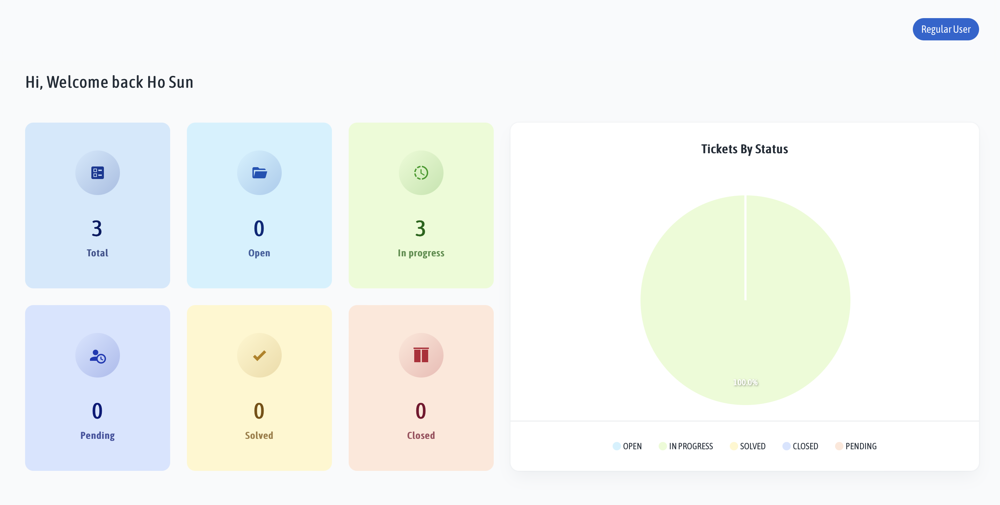

    
  #### Manager
  
  *	Managers can view the status of tickets for the company
    * Total, Open In Progress, Pending Solved and Closed
    * Pie Chart
      *	Tickets By Status
        
    
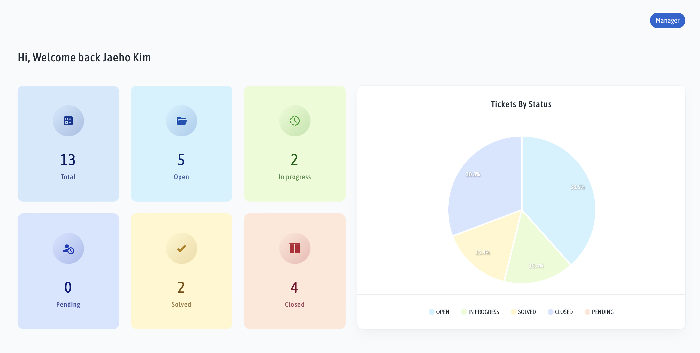

    
  #### Admin/Agents
  
  *	Admins/Agents can view the status of tickets from all companies as well as tickets by clients
    * Total, Open In Progress, Pending Solved and Closed
    * Pie Chart
      *	Tickets By Status
      * Tickets By Client
      
    
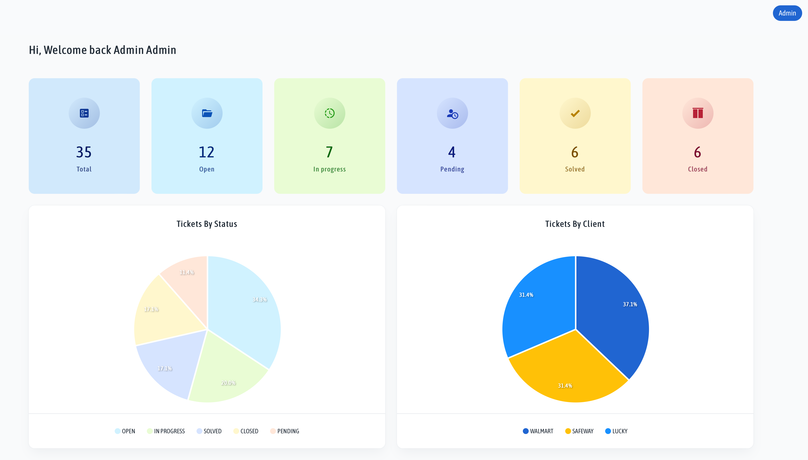
  
  

* ### Tickets:

  #### Ticket Main Page

    
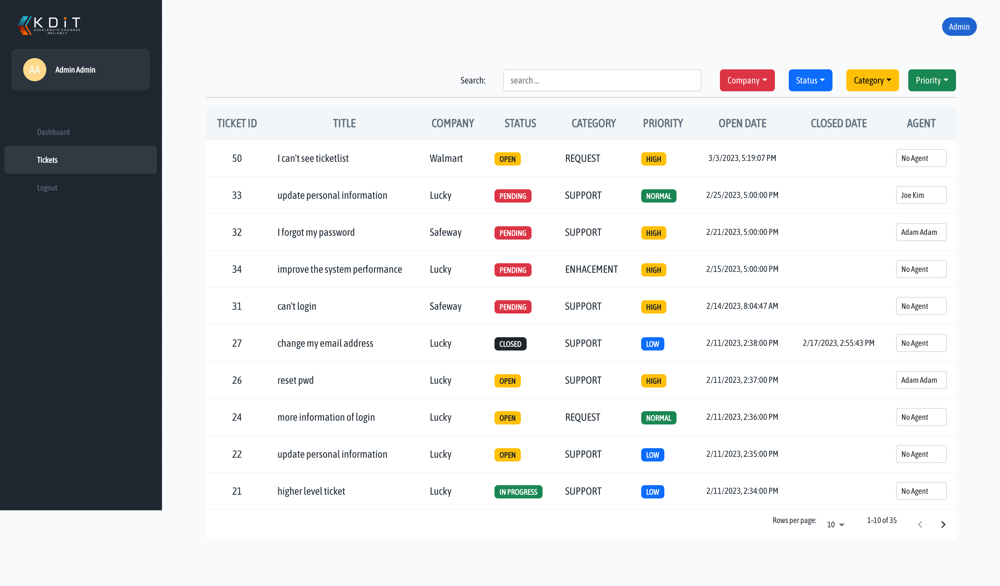
  

  #### Viewing Tickets
  
  * Navigate to the Tickets page using the navigation on the left-hand side.
  * Find the desired ticket using the search/filter features.

    
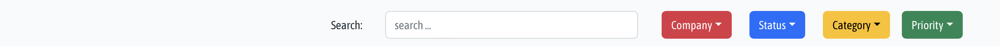
  
    
  * Click on the desired ticket.
  * Users can view the ticket details:
    * Title, Date Opened, Content (Details), Status, Category, Priority and Comments 

  #### Adding Comments
  
  * Use the Text Box to type out response/comment.
  * Click Add Comment submit the response.

    
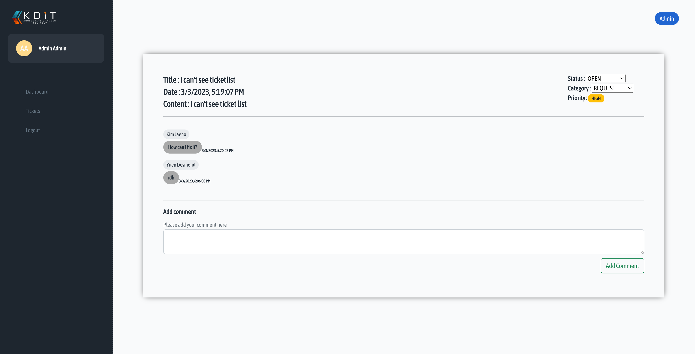
  
    
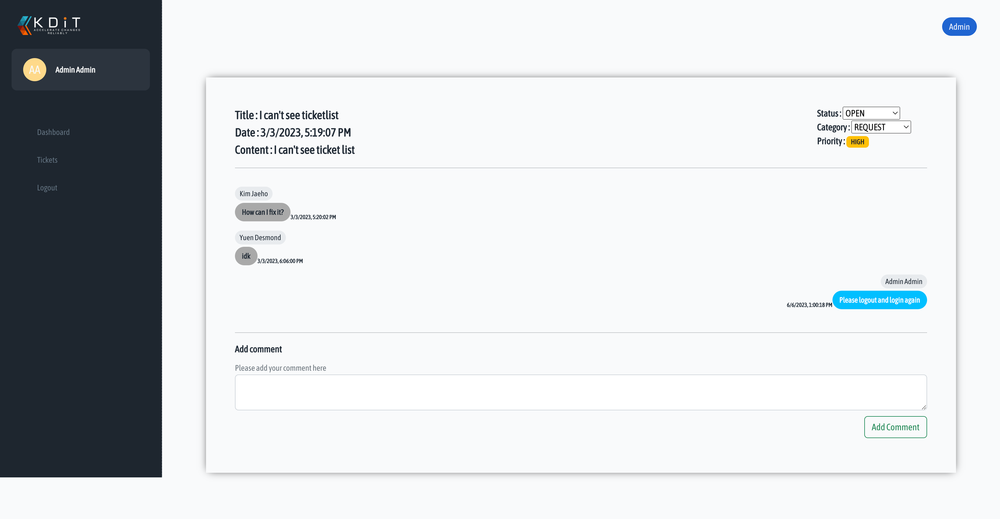
  
    
  #### Changing Status/Category

  * Note: This feature can only be used by Admins and Agents.
	* In the upper left-hand corner use the drop down menus to change the Status/Category:
	  * Selection for Status:
	    * OPEN
	    * IN PROGRESS
	    * SOLVED
	    * CLOSED
	    * PENDING

   
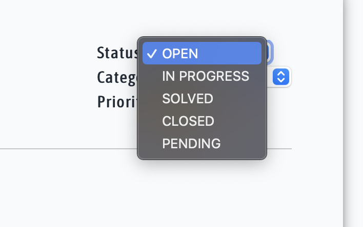
  
   
    * Selection for Category:
	    * REQUEST
	    * BUG
	    * DEFECT
	    * SUPPORT
	    * ENHACEMENT

   
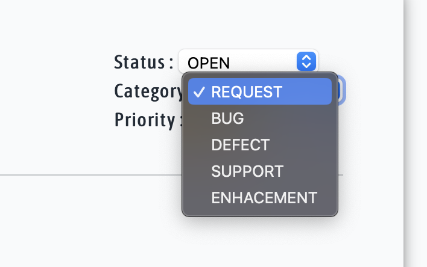

   
   #### Creating a Ticket
   
   * Note: This feature only applies to Managers and Regular Users.
    * Navigate to the Tickets page using the navigation on the left-hand side.
    * Find the desired ticket using the search/filter features.
    
   

    
    * Click the Add New Ticket button (can be found on the tickets page).

   
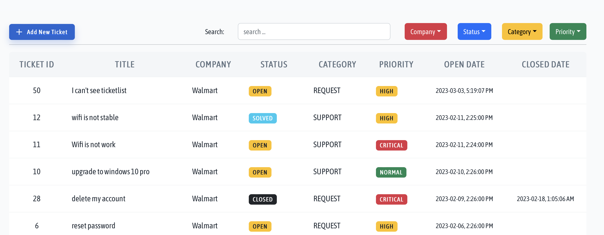

    * Enter the title of the ticket.

   
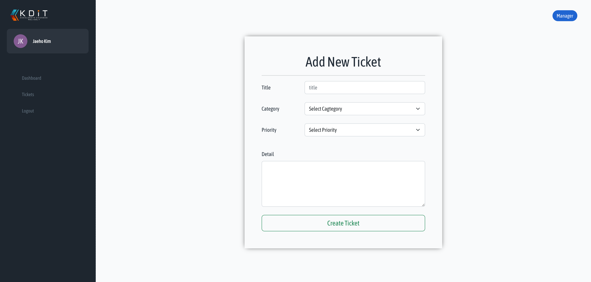

  
    * Select the category of the ticket using the Category dropdown menu.
      * Possible selections include:
        * REQUEST
	      * BUG
	      * DEFECT
	      * SUPPORT
	      * ENHACEMENT

   
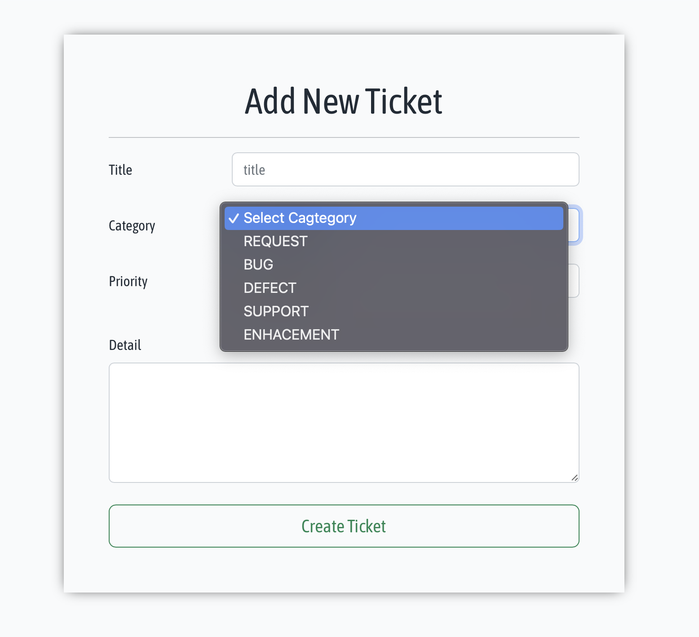

   
    * Select the priority of the ticket using the Priority dropdown menu.
      * Possible selections include:
        * LOW
	* NORMAL
	* HIGH
	* CRITICAL

   
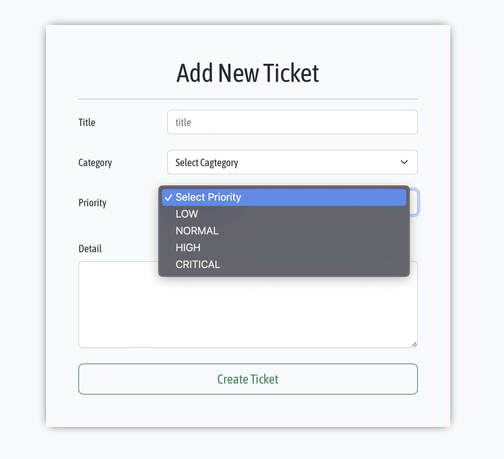

   
    * Create a description.
      * Using the Detail text box input a description of the current ticket.

    * Submitting the ticket.
      * To create the ticket ensure that all fields have been filled and completed.
      * Once complete, click Create Ticket to submit the ticket. 

   
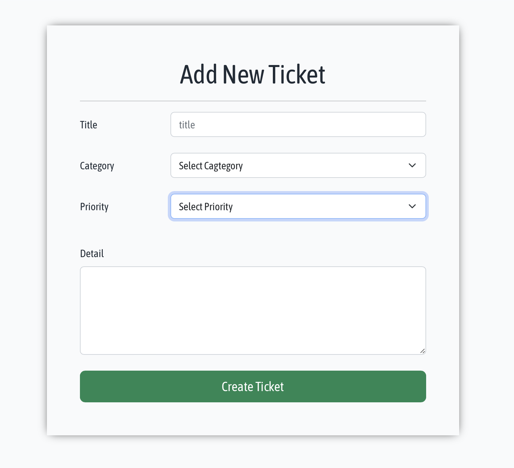

   
  #### Assign/Change Ticket Agent
    * Note: This feature is only applies to Admins
      * Simply click on the box of the respective ticket to assign/change the ticket’s agent.
      
   
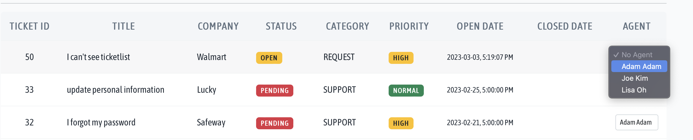

  
